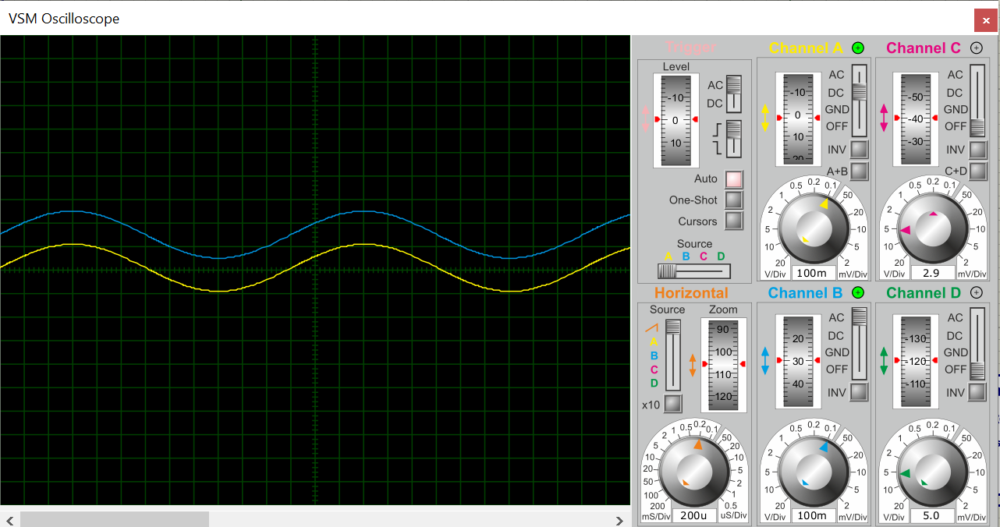
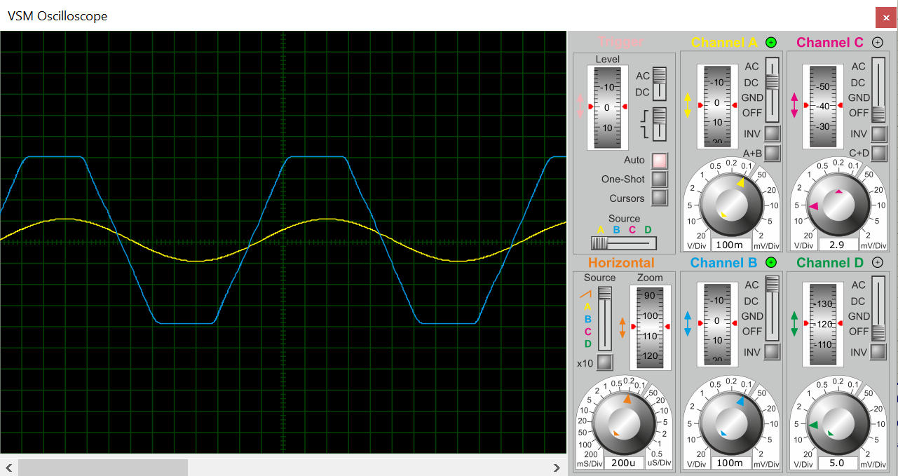
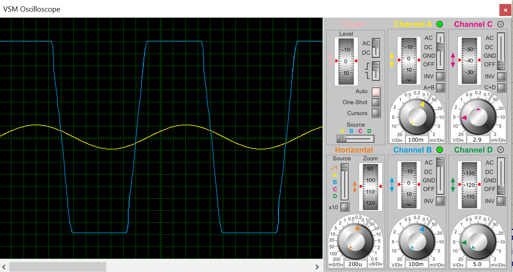

# Analog Guitar Distortion Pedal (Hard-Clipping)

This repository contains the design, schematic, and simulation of an analog guitar distortion pedal featuring a hard-clipping diode stage, alongside integrated passive **Tone** and **Volume** controls. The circuit was designed and verified using **Proteus VSM**.

---

## Project Structure

The repository is organized as follows:
* 📂 **`schematics/`**: Contains the full circuit diagram.
* 📂 **`simulation/`**: Contains the Proteus project file (`.pdsprj`) ready for simulation.
* 📂 **`media/`**: Contains oscilloscope captures showing the signal behavior under different control settings.

---

## Circuit Schematic

Below is the complete, verified schematic of the pedal, showing the op-amp input stage, clipping diodes, and passive filters:

---

## Simulation Results

The simulation was verified using the Proteus Virtual Oscilloscope. The yellow signal (**Channel A**) represents the clean sine wave input (guitar signal), while the blue signal (**Channel B**) represents the output stage under different gain levels:

### 1. Clean / Low Gain Response
With the gain control at its minimum, the pedal acts as a clean boost. The output signal preserves its original sine wave form without distortion.

### 2. Medium Gain (Moderate Clipping)
As the gain increases, the signal peaks begin to flatten. The diodes start conducting, introducing a warm and classic overdrive/crunch tone.

### 3. Hard Clipping (Maximum Distortion)
At maximum gain, the signal peaks are heavily compressed and squared off by the 1N4148 silicon diodes. This hard-clipping produces a heavy, aggressive distortion rich in odd harmonics.

